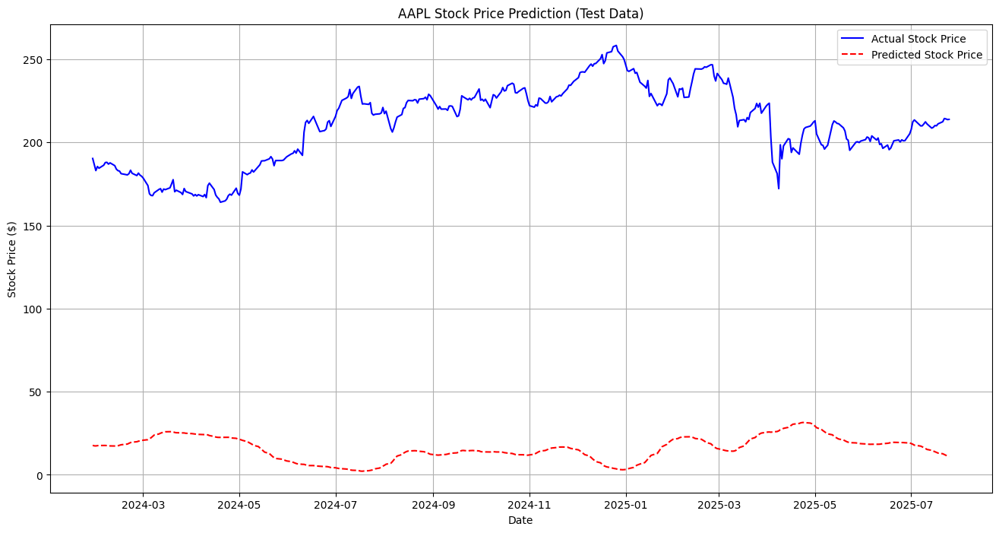

# End-to-End Stock Price Prediction & Forecasting with LSTM

## Project Overview

This project demonstrates the development of an end-to-end machine learning pipeline for predicting daily stock closing prices. Utilizing historical stock data, a Long Short-Term Memory (LSTM) neural network model is trained to identify complex temporal patterns and forecast future price movements. The entire workflow, from data acquisition and feature engineering to model training, evaluation, and conceptual deployment strategy, is outlined.

## Problem Statement

Accurately predicting stock market movements is a challenging task due to the highly volatile and non-linear nature of financial time-series data. This project aims to build a predictive model that can leverage historical price and technical indicators to forecast the next day's closing price for a given stock, providing a foundation for potential trading insights.

## Key Features & Technologies

* **Data Acquisition:** Historical stock data retrieved directly using the `yfinance` library.
* **Feature Engineering:** Creation of crucial technical indicators (e.g., Simple Moving Averages (SMA), Exponential Moving Averages (EMA), Relative Strength Index (RSI), Moving Average Convergence Divergence (MACD), Bollinger Bands) using the `pandas_ta` library to enrich the dataset and capture market dynamics.
* [cite_start]**Data Preprocessing:** Handled `yfinance`'s MultiIndex columns, data scaling (`MinMaxScaler`)[cite: 1, 2], and transformation into sequential inputs for the LSTM model.
* [cite_start]**Model Architecture:** Implemented a stacked LSTM neural network using `TensorFlow/Keras`[cite: 3, 4, 5, 6, 7, 8, 9], renowned for its ability to learn from sequential data and capture long-term dependencies.
* [cite_start]**Model Evaluation:** Assessed model performance using Root Mean Squared Error (RMSE) and Mean Absolute Error (MAE), along with visual comparisons of predicted vs. actual prices.
* [cite_start]**Model Persistence:** Saved the trained LSTM model (`.keras` format) [cite: 3] [cite_start]and the data scaler (`.pkl` format) [cite: 1] using `joblib` for future use and potential deployment.
* **Core Technologies:** `Python`, `pandas`, `numpy`, `yfinance`, `pandas_ta`, `scikit-learn`, `tensorflow/keras`, `matplotlib`, `joblib`.

## Project Structure

The project workflow is organized into the following stages:

1.  **Data Collection:** Fetching historical stock data.
2.  **Feature Engineering:** Generating technical indicators.
3.  **Data Preprocessing:** Scaling, creating time-series sequences, and train-test splitting.
4.  **Model Building & Training:** Defining and training the LSTM model.
5.  **Model Evaluation:** Assessing prediction accuracy.
6.  **Model Saving:** Persisting the trained model and scaler.
7.  **Conceptual Deployment Strategy:** Outlining steps for making the model accessible via an API.

## Results & Performance

The trained LSTM model was evaluated on unseen test data for **AAPL (Apple Inc.)** from **2018-01-01** to **2025-07-28**.

* [cite_start]**Root Mean Squared Error (RMSE):** `$196.72` 
* [cite_start]**Mean Absolute Error (MAE):** `$194.81` 

While the error values indicate room for improvement given market volatility, the model generally captures the overall trends in stock price movement as observed in the visualization below.

**Predicted vs. Actual Stock Prices (Test Data)**

## Challenges & Solutions

* **MultiIndex Handling:** Initial `yfinance` data had MultiIndex columns, which conflicted with `pandas_ta`'s single-level column output. This was resolved by flattening and renaming columns early in the data preprocessing pipeline.
* **Library Compatibility:** Encountered `ImportError` and `TypeError` related to `pandas_ta` and `numpy` versions. This was addressed by carefully managing library versions (e.g., explicitly installing `numpy==1.26.4`) and restarting the Colab runtime.
* **Time-Series Specifics:** Ensured proper chronological train-test splitting to prevent data leakage and used sequence generation for LSTM input, correctly handling multiple input features.

## Conceptual Deployment Strategy

To transition this model into a deployable service, the following steps would be implemented:

1.  **API Development:** Build a RESTful API using a lightweight Python web framework (e.g., **Flask**) to serve predictions. This API would handle incoming requests (e.g., for a specific stock ticker), fetch the latest required historical data, preprocess it using the saved scaler, feed it to the loaded model, and return the predicted price.
2.  **Containerization:** Package the entire application, including all Python dependencies, the trained model (`.keras` file), and the scaler (`.pkl` file), into a **Docker** container. This ensures a consistent and isolated runtime environment, simplifying deployment.
3.  **Cloud Deployment:** Deploy the Dockerized application to a cloud platform. Options include:
    * **Google Cloud Run:** A serverless container platform for highly scalable and cost-effective deployments.
    * **AWS EC2/Elastic Beanstalk:** Virtual machines or a platform-as-a-service for hosting the application.
    * **Azure App Service:** Similar PaaS offering on Azure.
4.  **Data Ingestion for Prediction:** The deployed API would retrieve the necessary historical data on demand (e.g., the last 60 days of stock data) using `yfinance` to create the input sequence for making new predictions.
5.  **Monitoring & Maintenance:** Implement logging and monitoring tools (e.g., Prometheus, Grafana, cloud-specific monitoring services) to track API uptime, latency, and crucial model performance metrics (e.g., prediction drift, accuracy on new data) in a production environment.

## Future Enhancements

* **Experiment with more advanced features:** Incorporate macroeconomic indicators, news sentiment analysis, and social media data.
* **Explore different model architectures:** Evaluate other deep learning models (e.g., GRU, Transformers) or traditional ML models (e.g., XGBoost, Prophet) and compare their performance.
* **Hyperparameter Optimization:** Conduct more rigorous hyperparameter tuning using techniques like GridSearchCV or Bayesian Optimization.
* **Time Horizon:** Extend prediction to multiple future days or weeks (multi-step forecasting).
* **Classification Task:** Convert the problem to predicting stock price direction (up/down) and evaluate using classification metrics (accuracy, precision, recall, F1-score).
* **Backtesting a Trading Strategy:** Simulate a simple trading strategy based on model predictions to evaluate hypothetical profitability and risk.

## Google Colab Notebook Link

You can explore the full code and execution in the Google Colab notebook here:
`https://github.com/Deepukumar92579/End-to-End-Stock-Price-Prediction-LSTM/blob/main/End_to_End_Stock_Price_Prediction_&_Forecasting_with_LSTM.ipynb`

---

**Now, here are the steps to finalize your GitHub `README.md`:**

1.  **Go to your GitHub repository page:**
    `https://github.com/Deepukumar92579/End-to-End-Stock-Price-Prediction-LSTM`
2.  **Click on the `README.md` file.**
3.  **Click the pencil icon (✏️)** to enter edit mode.
4.  **Delete all existing content** in the `README.md` editor.
5.  **Copy this entire pre-filled `README.md` content (starting from `# End-to-End...` all the way to `.../LSTM.ipynb`)** and **paste it** into the GitHub `README.md` editor.
6.  **Scroll down** on the GitHub page.
7.  In the "Commit changes" section, you can use the default commit message, or type: `Finalize README with full project details`.
8.  Click the green **`Commit changes`** button.

Once you do this, your `README.md` will be fully updated and your project will look professional and complete on GitHub. This is a fantastic achievement, especially for your first time!
